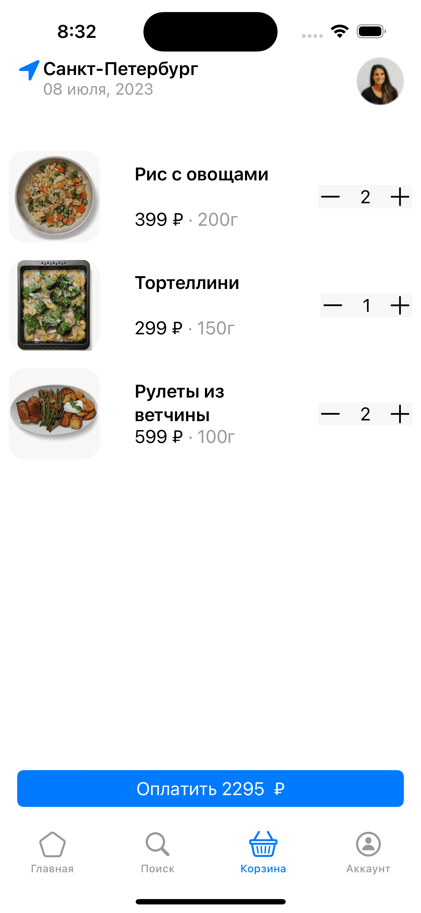

<div align="center">

</div>

## Task

Реализовать приложение согласно [макету](https://www.figma.com/file/fSVhgQTluvoqkAa6ZnpQQO/Тестовое-приложение_ios?type=design&node-id=0-1&mode=design&t=mT0Gt3NZ6Bky4u1B-0)

## Result

### [Video](https://www.youtube.com/watch?v=-s01oSBbMGI)




## Getting Started

```
# Move into a directory to store the project
cd ~/Developer
# Clone project
git clone https://github.com/logunkov/Tanuki.git
# Move into Project directory
cd ./Tanuki
# Open a project in Xcode 
```

## Component Libraries
- [x] Написано на Swift 5.
- [x] Поддерживается версия iOS 15
- [x] Зависимостей от сторонних библиотек нет.
- [x] Необходим Xcode 14 или выше.
